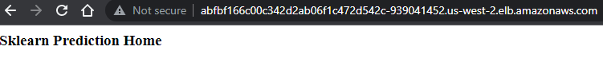

# Udacity Cloud DevOpe Engineer Nanodegree Capstone Project

In this project you will apply the skills and knowledge which were developed throughout the Cloud DevOps Nanodegree program. These include:

- Working in AWS
- Using Jenkins or Circle CI to implement Continuous Integration and Continuous Deployment
- Building pipelines
- Working with Ansible and CloudFormation to deploy clusters
- Building Kubernetes clusters
- Building Docker containers in pipelines

### Step 1: Propose and Scope the Project
- [x] Pipeline details
- [x] Use Circle CI for the Continous Integration phrase
- [x] Implement a rolling deployment
- [x] Deploy an application written in Python that predicts Boston house prices

### Step 2: Use Circle CI and implement blue/green or rolling deployment.
- [x] Setup Circle CI account and connect your GIT repository
- [x] Setup the environment to which you deploy the code

### Step 3: Pick AWS Kubernetes as a Service.
- [x] Use Ansible or CloudFormation to build your Kubernetes Cluster.
- [x] Initialize Kubernetes Cluster

### Step 4: Build your pipeline
- [x] Construct your pipeline in your GitHub repository.
- [x] Set up all the steps that your pipeline will include.
- [x] Configure a deployment pipeline.
- [x] Include your Dockerfile/source code in the Git repository.
- [x] Include with your Linting step both a failed Linting screenshot and a successful Linting screenshot to show the Linter working properly.

### Step 5: Test your pipeline
- [x] Perform builds on your pipeline.
- [x] Verify that your pipeline works as you designed it.
- [x] Take a screenshot of the Circle CI pipeline showing deployment, and a screenshot of your AWS EC2 page showing the newly created (for blue/green) or modified (for rolling) instances. Make sure you name your instances differently between blue and green deployments.

## Screenshots

- Pipeline  

- Linting error  

- Linting ok  

- Deploy success  

- Rolling update in progress 

- Containers before  

- Containers after  

- Application screenshot  

